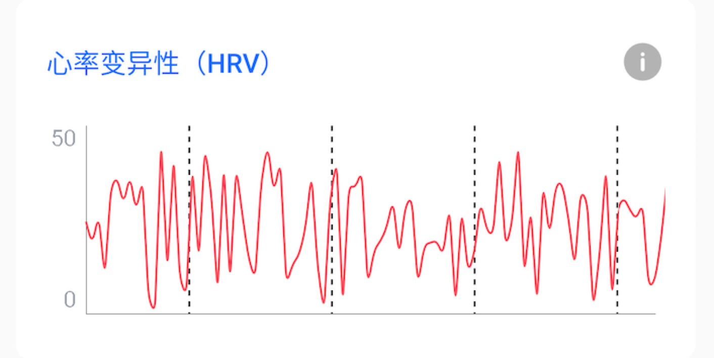

[English Readme](/Entertech_UI_Detail_API.md)
# Entertech UI控件详细API说明

## 实数数据

与情感云服务交互时的实时数据展示。

#### RealtimeHeartRateView

实时心率展示控件


| 参数                    | 类型             | 默认值      | 说明                   |
| ----------------------- | ---------------- | ----------- | ---------------------- |
| rhrv_mainColor          | color            | `#23233A`   | 主色                   |
| rhrv_textColor          | color            | `#FFFFFF`   | 字体颜色               |
| rhrv_background         | color\|reference | `#23233A`   | 背景                   |
| rhrv_isShowExtremeValue | boolean          | true        | 是否显示心率最大最小值 |
| rhrv_textFont           | string           | system font | 字体文件名             |
| rhrv_isShowInfoIcon     | boolean          | true        | 是否显示‘说明’图标     |

#### RealtimeAffectiveView

实时情感值控件，目前的实时值有：注意力、放松度、压力水平、愉悦度、激活度以及和谐度。


| 参数               | 类型             | 默认值      | 说明                                                         |
| ------------------ | ---------------- | ----------- | ------------------------------------------------------------ |
| rav_mainColor      | color            | `#23233A`   | 主色                                                         |
| rav_textColor      | color            | `#FFFFFF`   | 字体颜色                                                     |
| rav_background     | color\|reference | `#23233A`   | 背景                                                         |
| rav_textFont       | string           | system font | 字体文件名                                                   |
| rav_isShowInfoIcon | boolean          | true        | 是否显示‘说明’图标                                           |
| rav_infoUrl        | string           | 无          | 控件右上角的说明链接                                         |
| rav_affectiveType  | enum             | Attention   | 情感类型。枚举：Attention(注意力)、Relaxation(放松度)、Pressure(压力水平)、Pleasure(愉悦度)、Arousal(激活度)、Coherence(和谐度) |

#### RealtimeBrainwaveSpectrumView

实时脑波频谱


| 参数                  | 类型             | 默认值                                       | 说明                                                   |
| --------------------- | ---------------- | -------------------------------------------- | ------------------------------------------------------ |
| rbsv_mainColor        | color            | `#23233A`                                    | 主色                                                   |
| rbsv_textColor        | color            | `#FFFFFF`                                    | 字体颜色                                               |
| rbsv_background       | color\|reference | `#23233A`                                    | 背景                                                   |
| rbsv_textFont         | string           | system font                                  | 字体文件名                                             |
| rbsv_isShowInfoIcon   | boolean          | true                                         | 是否显示‘说明’图标                                     |
| rbsv_processBarColors | string           | "`#FFC200,#FF4852,#00D993,#0064FF,#0064FF`‘’ | 进度条颜色，依次对应 γ，β，α，θ，δ。中间用英文逗号间隔 |

#### RealtimeBrainwaveView

实时脑波图


| 参数                    | 类型             | 默认值      | 说明               |
| ----------------------- | ---------------- | ----------- | ------------------ |
| rbv_mainColor           | color            | `#23233A`   | 主色               |
| rbv_textColor           | color            | `#FFFFFF`   | 字体颜色           |
| rbv_background          | color\|reference | `#23233A`   | 背景               |
| rbv_textFont            | string           | system font | 字体文件名         |
| rbv_isShowInfoIcon      | boolean          | true        | 是否显示‘说明’图标 |
| rbv_leftBrainwaveColor  | color            | `#FF4852`   | 左脑波曲线颜色     |
| rbv_rightBrainwaveColor | color            | `#0064FF`   | 右脑波曲线颜色     |

#### RealtimeHRVView

实时心率变异性曲线



| 参数                 | 类型             | 默认值      | 说明               |
| -------------------- | ---------------- | ----------- | ------------------ |
| rhrvv_background     | color\|reference | `#23233A`   | 背景               |
| rhrvv_mainColor      | color            | `#23233A`   | 主色               |
| rhrvv_textColor      | color            | `#FFFFFF`   | 字体颜色           |
| rhrvv_textFont       | string           | system font | 字体文件名         |
| rhrvv_isShowInfoIcon | boolean          | true        | 是否显示‘说明’图标 |
| rhrvv_infoUrl        | string           | 无          | ‘说明’图标链接     |
| rhrvv_lineColor      | color            | `#ff4852`   | 曲线颜色           |

####

## 报表文件

### 文件存储

通过ReportFileHelper进行报表文件的读写

```kotlin
var reportFileHelpr = ReportFileHelper.getInstance()
```

```kotlin
reportFileHelpr.storeReportFile(fileName,startTime,reportData,interruptTimestampList)
```

#### 参数说明

**开始时间**

体验的开始时间，格式：时间戳（秒）

**报表数据**

```kotlin
class ReportData {
    var reportPleasureEnitty: ReportPleasureEnitty? = null
    var reportAttentionEnitty: ReportAttentionEnitty? = null
  	var reportPressureEnitty: ReportPressureEnitty? = null
    var reportRelaxationEnitty: ReportRelaxationEnitty? = null
    var reportHRDataEntity: ReportHRDataEntity? = null
    var reportEEGDataEntity: ReportEEGDataEntity? = null
}
```

**中断时间**

```kotlin
class ReportInterruptor {
    var interruptStartTime:Long? = null
    var interruptEndTime:Long? = null
}
```

### 文件读取

根据开始时间读取报表文件

```kotlin
var reportData = reportFileHelpr.readReportFile(fileName)
```

### 报表图表

**ReportBrainwaveSpectrumView**


| 参数                    | 类型             | 默认值                                    | 说明                                |
| ----------------------- | ---------------- | ----------------------------------------- | ----------------------------------- |
| rbs_mainColor           | color            | `#23233A`                                 | 主色                                |
| rbs_textColor           | color            | `#FFFFFF`                                 | 字体颜色                            |
| rbs_background          | color\|reference | `#23233A`                                 | 背景                                |
| rbs_isShowInfoIcon      | boolean          | true                                      | 是否显示说明图标                    |
| rbs_isAbsoluteTimeAxis  | boolean          | false                                     | 是否为绝对时间轴                    |
| rbs_pointCount          | integer          | 100                                       | 显示的点数                          |
| rbs_spectrumColors      | string           | `#23233A,#23233A,#23233A,#23233A,#23233A` | 各个占比颜色，一次对应γ，β，α，θ，δ |
| rbs_timeUnit            | integer          | 400ms                                     | 采样前两点时间间隔，单位毫秒        |
| rbs_isTitleIconShow     | boolean          | true                                      | 是否显示标题栏图标                  |
| rbs_title               | string           | 无                                        | 标题                                |
| rbs_titleIcon           | reference        | 无                                        | 标题图标                            |
| rbs_isTitleMenuIconShow | boolean          | true                                      | 是否显示标题栏菜单图标              |
| rbs_titleMenuIcon       | reference        | 无                                        | 标题栏菜单图标                      |
| rbs_gridLineColor       | color            | `#E9EBF1`                                 | 网格线颜色                          |
| rbs_labelColor          | color            | `#9AA1A9`                                 | 便签颜色                            |
| rbs_xAxisUnit           | string           | `Time(min)`                               | 横坐标单位说明                      |

**ReportLineChartCard**


| 参数                     | 类型             | 默认值      | 说明                         |
| ------------------------ | ---------------- | ----------- | ---------------------------- |
| rlcc_isTitleIconShow     | boolean          | true        | 是否显示标题栏图标           |
| rlcc_title               | string           | 无          | 标题                         |
| rlcc_titleIcon           | reference        | 无          | 标题图标                     |
| rlcc_isTitleMenuIconShow | boolean          | true        | 是否显示标题栏菜单图标       |
| rlcc_titleMenuIcon       | reference        | 无          | 标题栏菜单图标               |
| rlcc_mainColor           | color            | `#0064ff`   | 主色                         |
| rlcc_textColor           | color            | `#333333`   | 文本色                       |
| rlcc_background          | color\|reference | 无          | 背景                         |
| rlcc_pointCount          | integer          | 100         | 图标所显示的点数             |
| rlcc_lineColor           | color            | `#ff0000`   | 曲线颜色                     |
| rlcc_timeUnit            | integer          | 400ms       | 采样前两点时间间隔，单位毫秒 |
| rlcc_lineWidth           | dimension        | 1.5f        | 曲线宽度                     |
| rlcc_gridLineColor       | color            | `#E9EBF1`   | 网格线颜色                   |
| rlcc_labelColor          | color            | `#9AA1A9`   | 标签颜色                     |
| rlcc_xAxisUnit           | string           | `Time(min)` | 横坐标单位说明               |
| rlcc_isDrawFill          | boolean          | false       | 是否填充曲线背景色           |

**ReportAffectiveLineChartCard**


| 参数                      | 类型             | 默认值      | 说明                         |
| ------------------------- | ---------------- | ----------- | ---------------------------- |
| ralcc_isTitleIconShow     | boolean          | true        | 是否显示标题栏图标           |
| ralcc_title               | string           | 无          | 标题                         |
| ralcc_titleIcon           | reference        | 无          | 标题图标                     |
| ralcc_isTitleMenuIconShow | boolean          | true        | 是否显示标题栏菜单图标       |
| ralcc_titleMenuIcon       | reference        | 无          | 标题栏菜单图标               |
| ralcc_mainColor           | color            | `#0064ff`   | 主色                         |
| ralcc_textColor           | color            | `#333333`   | 文本色                       |
| ralcc_background          | color\|reference | 无          | 背景                         |
| ralcc_pointCount          | integer          | 100         | 图标所显示的点数             |
| ralcc_attentionLineColor  | color            | `#ff0000`   | 注意力曲线颜色               |
| ralcc_timeUnit            | integer          | 400ms       | 采样前两点时间间隔，单位毫秒 |
| ralcc_lineWidth           | dimension        | 1.5f        | 曲线宽度                     |
| ralcc_gridLineColor       | color            | `#E9EBF1`   | 网格线颜色                   |
| ralcc_labelColor          | color            | `#9AA1A9`   | 标签颜色                     |
| ralcc_xAxisUnit           | string           | `Time(min)` | 横坐标单位说明               |
| ralcc_relaxationLineColor | color            | `#0000ff`   | 放松度曲线                   |

**ReportPressureCard**

