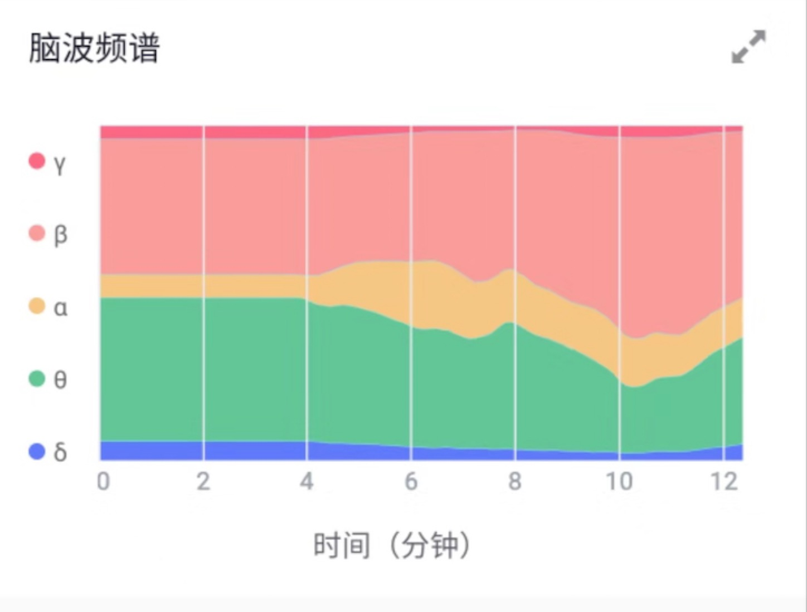

# Entertech UI control detailed API description

## Real data

Real-time data display when interacting with emotional cloud services

#### RealtimeHeartRateView

Real-time heart rate display widget


| Parameters | Type | Default Value | Description |
| ----------------------- | ---------------- | ----------- | ---------------------- |
| rhrv_mainColor | color | `#23233A` | Main color |
| rhrv_textColor | color | `#FFFFFF` | Font color |
| rhrv_background | color\|reference | `#23233A` | background |
| rhrv_isShowExtremeValue | boolean | true | Whether to display the maximum and minimum heart rate |
| rhrv_textFont | string | system font | Font file name |
| rhrv_isShowInfoIcon | boolean | true | Whether to show the ‘description’ icon |

#### RealtimeAffectiveView

Real-time emotional value control. The current real-time values are: attention, relaxation, stress level, pleasure, arousal, and coherence.


| Parameters | Type | Default Value | Description |
| ------------------ | ---------------- | ----------- |--------------------------------- |
| rav_mainColor | color | `#23233A` | Main color |
| rav_textColor | color | `#FFFFFF` | Font color |
| rav_background | color\|reference | `#23233A` | Background |
| rav_textFont | string | system font | Font file name |
| rav_isShowInfoIcon | boolean | true | Whether to display the ‘description’ icon |
| rav_infoUrl | string | None | Description link in the upper right corner of the control |
| rav_affectiveType | enum | Attention | Affective type. Enumeration: Attention, Relaxation, Pressure, Pleasure, Arousal, Coherence |
#### RealtimeBrainwaveSpectrumView

Realtime brainwave spectrum


| Parameters | Type | Default Value | Description |
| --------------------- | ---------------- | ---------------------- | ----------------------- |
| rbsv_mainColor | color | `#23233A` | Main color |
| rbsv_textColor | color | `#FFFFFF` | Font color |
| rbsv_background | color\|reference | `#23233A` | Background |
| rbsv_textFont | string | system font | Font file name |
| rbsv_isShowInfoIcon | boolean | true | Whether to show the ‘description’ icon |
| rbsv_processBarColors | string | "`#FFC200,#FF4852,#00D993,#0064FF,#0064FF`‘’ | The color of the progress bar, corresponding to γ, β, α, θ, δ in turn. Use English commas in the middle |

#### RealtimeBrainwaveView

Realtime brainwave


| Parameters | Type | Default Value | Description |
| ----------------------- | ---------------- | ----------- | ------------- |
| rbv_mainColor | color | `#23233A` | Main color |
| rbv_textColor | color | `#FFFFFF` | Font color |
| rbv_background | color\|reference | `#23233A` | Background |
| rbv_textFont | string | system font | Font file name |
| rbv_isShowInfoIcon | boolean | true | Whether to display the ‘description’ icon |
| rbv_leftBrainwaveColor | color | `#FF4852` | Left brain wave curve color |
| rbv_rightBrainwaveColor | color | `#0064FF` | Right brain wave curve color |

#### RealtimeHRVView

Realtime HRV curve


| Parameters | Type | Default Value | Description |
| -------------------- | ---------------- | ----------- | ------------------ |
| rhrvv_background | color\|reference | `#23233A` | Background |
| rhrvv_mainColor | color | `#23233A` | Main color |
| rhrvv_textColor | color | `#FFFFFF` | Font color |
| rhrvv_textFont | string | system font | Font file name |
| rhrvv_isShowInfoIcon | boolean | true | Whether to display the ‘description’ icon |
| rhrvv_infoUrl | string | None | ‘Description’ icon link |
| rhrvv_lineColor | color | `#ff4852` | Curve color |

####

## Report file

### File storage

Read and write report files through ReportFileHelper

```kotlin
var reportFileHelpr = ReportFileHelper.getInstance()
```

```kotlin
reportFileHelpr.storeReportFile(fileName,startTime,reportData,interruptTimestampList)
```

#### Parameter Description

**Starting time**

The start time of the experience, format: timestamp (seconds)

**Report data**

```kotlin
class ReportData {
     var reportPleasureEnitty: ReportPleasureEnitty? = null
     var reportAttentionEnitty: ReportAttentionEnitty? = null
   var reportPressureEnitty: ReportPressureEnitty? = null
     var reportRelaxationEnitty: ReportRelaxationEnitty? = null
     var reportHRDataEntity: ReportHRDataEntity? = null
     var reportEEGDataEntity: ReportEEGDataEntity? = null
}
```

**Interruption time**

```kotlin
class ReportInterruptor {
     var interruptStartTime:Long? = null
     var interruptEndTime:Long? = null
}
```
### File Read

Read report file based on start time

```kotlin
var reportData = reportFileHelpr.readReportFile(fileName)
```

### Report chart

**ReportBrainwaveSpectrumView**



| Parameters | Type | Default Value | Description |
| ----------------------- | ---------------- | --------------------- | ------------------------- |
| rbs_mainColor | color | `#23233A` | Main color |
| rbs_textColor | color | `#FFFFFF` | Font color |
| rbs_background | color\|reference | `#23233A` | Background |
| rbs_isShowInfoIcon | boolean | true | Whether to display the description icon |
| rbs_isAbsoluteTimeAxis | boolean | false | Is it an absolute time axis |
| rbs_pointCount | integer | 100 | Number of points displayed |
| rbs_spectrumColors | string | `#23233A,#23233A,#23233A,#23233A,#23233A` | Each proportion color, once corresponding to γ, β, α, θ, δ |
| rbs_timeUnit | integer | 400ms | Time interval between two points before sampling, in milliseconds |
| rbs_isTitleIconShow | boolean | true | Whether to display the title bar icon |
| rbs_title | string | None | Title |
| rbs_titleIcon | reference | None | Title Icon |
| rbs_isTitleMenuIconShow | boolean | true | Whether to display the title bar menu icon |
| rbs_titleMenuIcon | reference | None | Title bar menu icon |
| rbs_gridLineColor | color | `#E9EBF1` | Grid line color |
| rbs_labelColor | color | `#9AA1A9` | Note color |
| rbs_xAxisUnit | string | `Time(min)` | Description of abscissa unit |

**ReportLineChartCard**


| Parameters | Type | Default Value | Description |
| ------------------------ | ---------------- | ---------- | ---------------- |
| rlcc_isTitleIconShow | boolean | true | Whether to display the title bar icon |
| rlcc_title | string | None | Title |
| rlcc_titleIcon | reference | None | Title Icon |
| rlcc_isTitleMenuIconShow | boolean | true | Whether to display the title bar menu icon |
| rlcc_titleMenuIcon | reference | None | Title bar menu icon |
| rlcc_mainColor | color | `#0064ff` | Main color |
| rlcc_textColor | color | `#333333` | Text color |
| rlcc_background | color\|reference | None | Background |
| rlcc_pointCount | integer | 100 | The number of points shown by the icon |
| rlcc_lineColor | color | `#ff0000` | Curve color |
| rlcc_timeUnit | integer | 400ms | Time interval between two points before sampling, in milliseconds |
| rlcc_lineWidth | dimension | 1.5f | Curve width |
| rlcc_gridLineColor | color | `#E9EBF1` | Grid line color |
| rlcc_labelColor | color | `#9AA1A9` | Label color |
| rlcc_xAxisUnit | string | `Time(min)` | Description of abscissa unit |
| rlcc_isDrawFill | boolean | false | Whether to fill the curve background color |

**ReportAffectiveLineChartCard**


| Parameters | Type | Default Value | Description |
| ------------------------- | ---------------- | ----------- | ------------------ |
| ralcc_isTitleIconShow | boolean | true | Whether to display the title bar icon |
| ralcc_title | string | None | Title |
| ralcc_titleIcon | reference | None | Title Icon |
| ralcc_isTitleMenuIconShow | boolean | true | Whether to display the title bar menu icon |
| ralcc_titleMenuIcon | reference | None | Title bar menu icon |
| ralcc_mainColor | color | `#0064ff` | Main color |
| ralcc_textColor | color | `#333333` | Text color |
| ralcc_background | color\|reference | None | Background |
| ralcc_pointCount | integer | 100 | The number of points shown by the icon |
| ralcc_attentionLineColor | color | `#ff0000` | Attention curve color |
| ralcc_timeUnit | integer | 400ms | Time interval between two points before sampling, in milliseconds |
| ralcc_lineWidth | dimension | 1.5f | Curve width |
| ralcc_gridLineColor | color | `#E9EBF1` | Grid line color |
| ralcc_labelColor | color | `#9AA1A9` | Label color |
| ralcc_xAxisUnit | string | `Time(min)` | Description of abscissa unit |
| ralcc_relaxationLineColor | color | `#0000ff` | Relaxation curve |

**ReportPressureCard**

