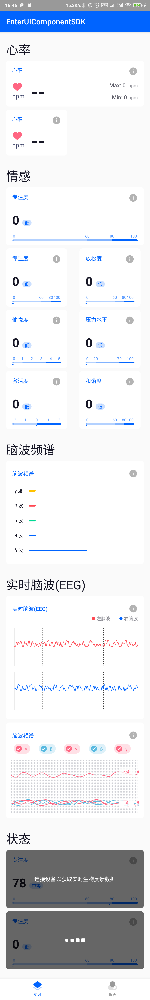

[English Readme](/README_EN.md)
# Enter-UI-Component-Android-SDK [ ](https://bintray.com/hzentertech/maven/uicomponentsdk/_latestVersion)

## 简介

简化了应用中UI的重复开发，包括情感云的实时体验和数据报表UI控件。

## 集成

### Gradle 自动集成

在module的build.gradle文件下添加以下依赖

```groovy
implementation 'cn.entertech:uicomponentsdk:1.2.6-alpha04'
```

在项目根目录的build.gradle文件下添加以下依赖地址

```groovy
allprojects {
    repositories {
        maven {
            url "https://dl.bintray.com/hzentertech/maven"
        }
    }
}
```

## 快速接入
**实时控件**

以实时脑波为例
### 1.在xml布局文件中声明控件

```xml
<cn.entertech.uicomponentsdk.realtime.RealtimeBrainwaveView
                    android:id="@+id/brainwave_view"
                    android:layout_marginTop="@dimen/activity_margin"
                    android:layout_marginLeft="@dimen/activity_margin"
                    android:layout_marginRight="@dimen/activity_margin"
                    android:layout_width="match_parent"
                    android:layout_height="wrap_content"
                    app:rbv_background="@drawable/shape_brainwave_bg"
                    app:rbv_mainColor="#ffffff"
                    app:rbv_textColor="#ffffff"
                    app:rbv_leftBrainwaveColor="#ff4852"
                    app:rbv_rightBrainwaveColor="#0064ff"
                    />
```

### 2.在代码文件中是指具体的值

```kotlin
//右脑波
brainwave_view.setRightBrainwave(rightBrainwave)
//左脑波
brainwave_view.setLeftBrainwave(leftBrainwave)
```

### 效果


**报表控件**

以脑波报表为例
### 1.在xml布局文件中声明控件

```xml
<cn.entertech.uicomponentsdk.report.ReportBrainwaveSpectrumView
                    app:rbs_background="@drawable/shape_custom_widget_bg"
                    android:layout_marginLeft="@dimen/activity_margin"
                    android:layout_marginRight="@dimen/activity_margin"
                    android:id="@+id/report_brainwave_spectrum"
                    android:layout_width="match_parent"
                    android:layout_height="wrap_content"
                    app:rbs_isAbsoluteTimeAxis="true"
                    app:rbs_textColor="@color/white"
                    >

</cn.entertech.uicomponentsdk.report.ReportBrainwaveSpectrumView>

```

### 2.在代码文件中是指具体的值

```kotlin
report_brainwave_spectrum.setBrainwaveSpectrums(
            startTime!!, //体验开始时间
            gammaCurve,  //γ占比曲线
            betaCurve,   // β占比曲线
            alphaCurve,  //α占比曲线
            thetaCurve,  //θ占比曲线
            deltaCurve   //δ占比曲线
     )

```

### 效果


## 详细API
更多详细控件API可查看 [UI控件详细API说明](https://github.com/Entertech/Enter-UIComponent-Android-SDK/blob/master/Entertech%20UI%E6%8E%A7%E4%BB%B6%E8%AF%A6%E7%BB%86API%E8%AF%B4%E6%98%8E.md)

