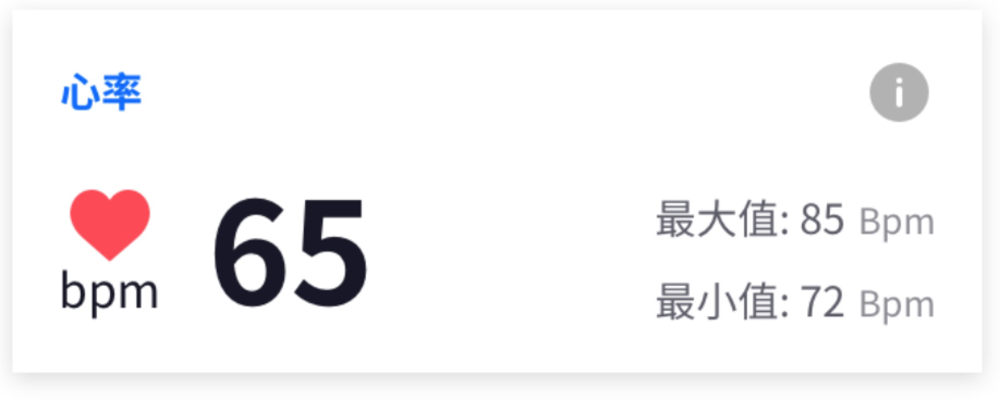
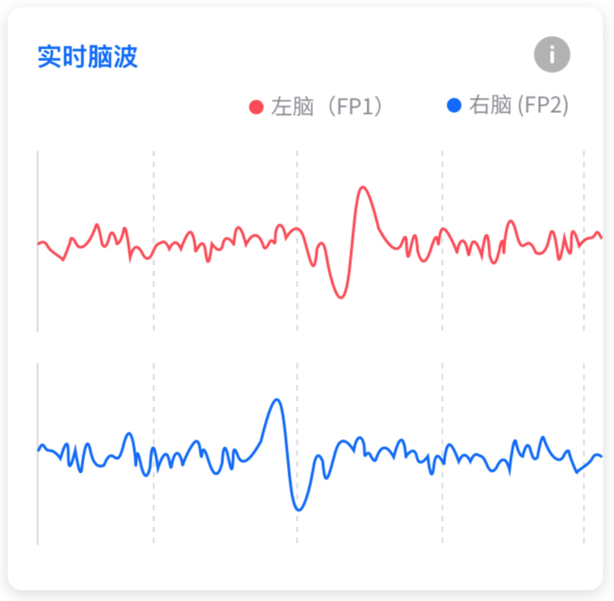

# Enter-UI-Component-Android-SDK 

## 简介

简化了应用中UI的重复开发，包括情感云的实时体验和数据报表UI控件。

## 集成

### Gradle 自动集成

在module的build.gradle文件下添加以下依赖

```groovy
implementation 'cn.entertech:uicomponent:1.0.0-alpha'
```

在项目根目录的build.gradle文件下添加以下依赖地址

```groovy
allprojects {
    repositories {
        maven {
            url "https://dl.bintray.com/hzentertech/maven"
        }
    }
}
```

## 实数数据

与情感云服务交互时的实时数据展示。

#### RealtimeHeartRateView

实时心率展示控件



| 参数                    | 类型             | 默认值      | 说明                   |
| ----------------------- | ---------------- | ----------- | ---------------------- |
| rhrv_mainColor          | color            | `#23233A`   | 主色                   |
| rhrv_textColor          | color            | `#FFFFFF`   | 字体颜色               |
| rhrv_background         | color\|reference | `#23233A`   | 背景                   |
| rhrv_isShowExtremeValue | boolean          | true        | 是否显示心率最大最小值 |
| rhrv_textFont           | string           | system font | 字体文件名             |
| rhrv_isShowInfoIcon     | boolean          | true        | 是否显示‘说明’图标     |

#### RealtimeAttentionView

实时注意力，类似控件还有RealtimeRelaxationView（实时放松度），RealtimePresuureView（实时压力水平）


| 参数               | 类型             | 默认值      | 说明               |
| ------------------ | ---------------- | ----------- | ------------------ |
| rav_mainColor      | color            | `#23233A`   | 主色               |
| rav_textColor      | color            | `#FFFFFF`   | 字体颜色           |
| rav_background     | color\|reference | `#23233A`   | 背景               |
| rav_textFont       | string           | system font | 字体文件名         |
| rav_isShowInfoIcon | boolean          | true        | 是否显示‘说明’图标 |

#### RealtimeBrainwaveSpectrumView

实时脑波频谱


| 参数                  | 类型             | 默认值                                       | 说明                                                   |
| --------------------- | ---------------- | -------------------------------------------- | ------------------------------------------------------ |
| rbsv_mainColor        | color            | `#23233A`                                    | 主色                                                   |
| rbsv_textColor        | color            | `#FFFFFF`                                    | 字体颜色                                               |
| rbsv_background       | color\|reference | `#23233A`                                    | 背景                                                   |
| rbsv_textFont         | string           | system font                                  | 字体文件名                                             |
| rbsv_isShowInfoIcon   | boolean          | true                                         | 是否显示‘说明’图标                                     |
| rbsv_processBarColors | string           | "`#FFC200,#FF4852,#00D993,#0064FF,#0064FF`‘’ | 进度条颜色，依次对应 γ，β，α，θ，δ。中间用英文逗号间隔 |

#### RealtimeBrainwaveView

实时脑波图


| 参数                    | 类型             | 默认值      | 说明               |
| ----------------------- | ---------------- | ----------- | ------------------ |
| rbv_mainColor           | color            | `#23233A`   | 主色               |
| rbv_textColor           | color            | `#FFFFFF`   | 字体颜色           |
| rbv_background          | color\|reference | `#23233A`   | 背景               |
| rbv_textFont            | string           | system font | 字体文件名         |
| rbv_isShowInfoIcon      | boolean          | true        | 是否显示‘说明’图标 |
| rbv_leftBrainwaveColor  | color            | `#FF4852`   | 左脑波曲线颜色     |
| rbv_rightBrainwaveColor | color            | `#0064FF`   | 右脑波曲线颜色     |

## 报表文件

### 文件存储

通过ReportFileHelper进行报表文件的读写

```kotlin
var reportFileHelpr = ReportFileHelper.getInstance()
```

```kotlin
reportFileHelpr.storeReportFile(fileName,startTime,reportData,interruptTimestampList)
```

#### 参数说明

**开始时间**

体验的开始时间，格式：时间戳（秒）

**报表数据**

```kotlin
class ReportData {
    var reportPleasureEnitty: ReportPleasureEnitty? = null
    var reportAttentionEnitty: ReportAttentionEnitty? = null
  	var reportPressureEnitty: ReportPressureEnitty? = null
    var reportRelaxationEnitty: ReportRelaxationEnitty? = null
    var reportHRDataEntity: ReportHRDataEntity? = null
    var reportEEGDataEntity: ReportEEGDataEntity? = null
}
```

**中断时间**

```kotlin
class ReportInterruptor {
    var interruptStartTime:Long? = null
    var interruptEndTime:Long? = null
}
```

### 文件读取

根据开始时间读取报表文件

```kotlin
var reportData = reportFileHelpr.readReportFile(fileName)
```

### 报表图表

**ReportBrainwaveSpecrumView**


| 参数                   | 类型             | 默认值                                    | 说明                                      |
| ---------------------- | ---------------- | ----------------------------------------- | ----------------------------------------- |
| rbs_mainColor          | color            | `#23233A`                                 | 主色                                      |
| rbs_textColor          | color            | `#FFFFFF`                                 | 字体颜色                                  |
| rbs_background         | color\|reference | `#23233A`                                 | 背景                                      |
| rbs_isShowInfoIcon     | boolean          | true                                      | 是否显示说明图标                          |
| rbs_isAbsoluteTimeAxis | boolean          | false                                     | 是否为绝对时间轴                          |
| rbs_sample             | integer          | 3                                         | 采样率，表示几个点采一个，默认3个点采一个 |
| rbs_spectrumColors     | string           | `#23233A,#23233A,#23233A,#23233A,#23233A` | 各个占比颜色，一次对应γ，β，α，θ，δ       |
| rbs_infoUrl            | string           |                                           |                                           |

**ReportHeartRateView**


| 参数                         | 类型             | 默认值    | 说明                                      |
| ---------------------------- | ---------------- | --------- | ----------------------------------------- |
| rhr_mainColor                | color            | `#23233A` | 主色                                      |
| rhr_textColor                | color            | `#FFFFFF` | 字体颜色                                  |
| rhr_background               | color\|reference | `#23233A` | 背景                                      |
| rhr_isShowInfoIcon           | boolean          | true      | 是否显示说明图标                          |
| rhr_isAbsoluteTimeAxis       | boolean          | false     | 是否为绝对时间轴                          |
| rhr_sample                   | integer          | 3         | 采样率，表示几个点采一个，默认3个点采一个 |
| rhr_isShowAvg                | boolean          | true      | 是否展示平均值                            |
| rhr_isShowMax                | boolean          | true      | 是否展示最大值                            |
| rhr_isShowMin                | boolean          | true      | 是否展示最小值                            |
| rhr_heartRateHighLineColor   | color            | `#23233A` | 心率较高曲线颜色                          |
| rhr_heartRateNormalLineColor | color            | `#23233A` | 心率正常曲线颜色                          |
| rhr_heartRateLowLineColor    | color            | `#23233A` | 心率较低曲线颜色                          |

**ReportHeartRateVariabilityView**


| 参数                   | 类型             | 默认值    | 说明                                      |
| ---------------------- | ---------------- | --------- | ----------------------------------------- |
| hrv_mainColor          | color            | `#23233A` | 主色                                      |
| hrv_textColor          | color            | `#FFFFFF` | 字体颜色                                  |
| hrv_background         | color\|reference | `#23233A` | 背景                                      |
| hrv_isShowInfoIcon     | boolean          | true      | 是否显示说明图标                          |
| hrv_isAbsoluteTimeAxis | boolean          | false     | 是否为绝对时间轴                          |
| hrv_sample             | integer          | 3         | 采样率，表示几个点采一个，默认3个点采一个 |
| hrv_isShowAvg          | boolean          | true      | 是否展示平均值                            |
| hrv_isShowMax          | boolean          | true      | 是否展示最大值                            |
| hrv_isShowMin          | boolean          | true      | 是否展示最小值                            |
| hrv_lineColor          | color            | `#23233A` | 曲线颜色                                  |

**ReportAffectiveView**


| 参数                  | 类型             | 默认值    | 说明                                      |
| --------------------- | ---------------- | --------- | ----------------------------------------- |
| ra_mainColor          | color            | `#23233A` | 主色                                      |
| ra_textColor          | color            | `#FFFFFF` | 字体颜色                                  |
| ra_background         | color\|reference | `#23233A` | 背景                                      |
| ra_isShowInfoIcon     | boolean          | true      | 是否显示说明图标                          |
| ra_isAbsoluteTimeAxis | boolean          | false     | 是否为绝对时间轴                          |
| ra_sample             | integer          | 3         | 采样率，表示几个点采一个，默认3个点采一个 |
| ra_isShowAvg          | boolean          | true      | 是否展示平均值                            |
| ra_isShowMax          | boolean          | true      | 是否展示最大值                            |
| ra_isShowMin          | boolean          | true      | 是否展示最小值                            |
| ra_fillColor          | color            | `#23233A` | 填充颜色                                  |
| ra_emotionType        | enum             | attention | 情感类型                                  |

**ReportPressureView**


| 参数                  | 类型             | 默认值    | 说明                                      |
| --------------------- | ---------------- | --------- | ----------------------------------------- |
| rp_mainColor          | color            | `#23233A` | 主色                                      |
| rp_textColor          | color            | `#FFFFFF` | 字体颜色                                  |
| rp_background         | color\|reference | `#23233A` | 背景                                      |
| rp_isShowInfoIcon     | boolean          | true      | 是否显示说明图标                          |
| rp_isAbsoluteTimeAxis | boolean          | false     | 是否为绝对时间轴                          |
| rp_sample             | integer          | 3         | 采样率，表示几个点采一个，默认3个点采一个 |
| rp_color              | color            | `#23233A` | 填充颜色                                  |


