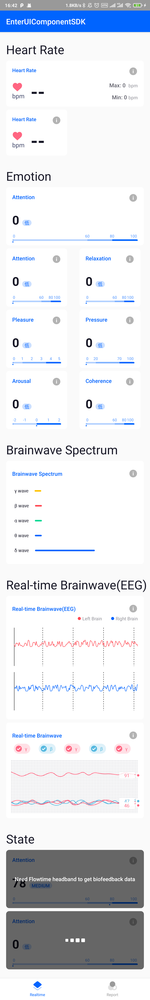
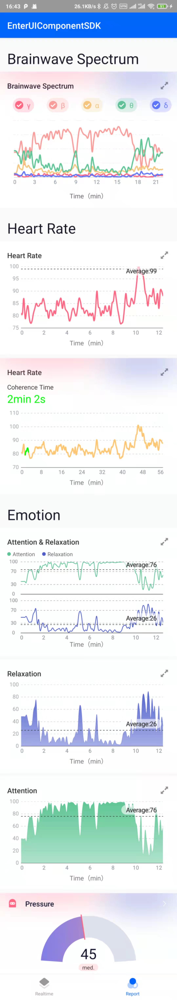

# Enter-UI-Component-Android-SDK [](https://maven-badges.herokuapp.com/maven-central/cn.entertech.android/uicomponentsdk)

## Introduction

Simplifies the repeated development of UI in the application, including real-time experience of affective cloud and data report UI controls.

## Getting Started

### Gradle

Add the following dependencies under the module's build.gradle file

```groovy
implementation 'cn.entertech.android:uicomponentsdk:1.2.10'
```

Add the following dependency address under the build.gradle file in the project root directory

```groovy
allprojects {
    repositories {
        mavenCentral()
    }
}
```

## How to use
**Realtime Widget**

Take real-time brain waves as an example
### 1.Declare the widget in the xml layout file

```xml
<cn.entertech.uicomponentsdk.realtime.RealtimeBrainwaveView
                    android:id="@+id/brainwave_view"
                    android:layout_marginTop="@dimen/activity_margin"
                    android:layout_marginLeft="@dimen/activity_margin"
                    android:layout_marginRight="@dimen/activity_margin"
                    android:layout_width="match_parent"
                    android:layout_height="wrap_content"
                    app:rbv_background="@drawable/shape_brainwave_bg"
                    app:rbv_mainColor="#ffffff"
                    app:rbv_textColor="#ffffff"
                    app:rbv_leftBrainwaveColor="#ff4852"
                    app:rbv_rightBrainwaveColor="#0064ff"
                    />
```

### 2.Refers to specific values in code

```kotlin
//right brainwave
brainwave_view.setRightBrainwave(rightBrainwave)
//left brainwave
brainwave_view.setLeftBrainwave(leftBrainwave)
```

### Display


**Report Widget**

Take real-time brain waves as an example
### 1.Declare the widget in the xml layout file

```xml
<cn.entertech.uicomponentsdk.report.ReportBrainwaveSpectrumView
                    app:rbs_background="@drawable/shape_custom_widget_bg"
                    android:layout_marginLeft="@dimen/activity_margin"
                    android:layout_marginRight="@dimen/activity_margin"
                    android:id="@+id/report_brainwave_spectrum"
                    android:layout_width="match_parent"
                    android:layout_height="wrap_content"
                    app:rbs_isAbsoluteTimeAxis="true"
                    app:rbs_textColor="@color/white"
                    >

</cn.entertech.uicomponentsdk.report.ReportBrainwaveSpectrumView>

```

### 2.Refers to specific values in code

```kotlin
report_brainwave_spectrum.setBrainwaveSpectrums(
            startTime!!, //practice start time
            gammaCurve,  //γ curve
            betaCurve,   // β curve
            alphaCurve,  //α curve
            thetaCurve,  //θ curve
            deltaCurve   //δ curve
     )

```

### Display


## Detail API
More detailed widgets API can be viewed [UI widgets detailed API description](https://github.com/Entertech/Enter-UIComponent-Android-SDK/blob/master/Entertech%20UI%E6%8E%A7%E4%BB%B6%E8%AF%A6%E7%BB%86API%E8%AF%B4%E6%98%8E.md)

